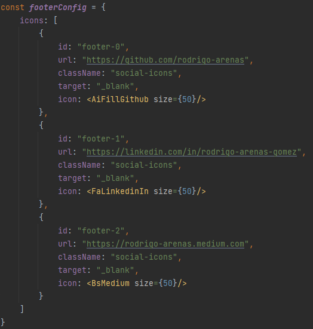
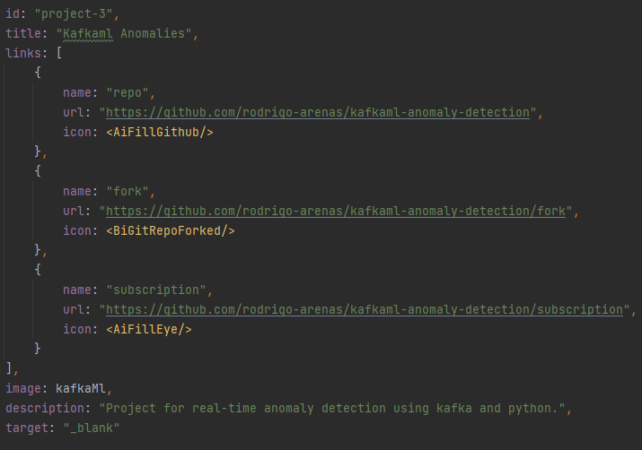

<h2>
  Personal Portfolio
  <a href="https://github.com/jayasri058/Portfolio.git" target="_blank">Website</a>
</h2>

This is my website to resume my work as a data scientist.
The page mainly uses React and MUI and is inspired by open-source components.

Feel free to use this project as a template, and please give a small credit by linking back to this project.
If you found this project helpful, consider giving it a 


**[Live Demo]([https://github.com/jayasri058/Portfolio.git](https://github.com/user-attachments/assets/b6141ba9-7e22-4a58-9c28-b931650fd0f4))**


## Installation Guide

* Fork the project 
  ```
  https://github.com/jayasri058/portfolio/fork
  ```
* Clone your fork
  ```
  git clone https://github.com/{yourusername}/portfolio.git
  ```
* Install the packages
  ```
  npm install
  ```
* Start the project
  ```
  npm start
  ```

## Customize your information

All the content (text, icons, links, etc.) are configured in the `assets` folders,
it has two kinds:

### Configs:

There is one configuration file per page or main component, for example, if you want
to modify the footer icons and hyperlinks, go to the footerConfig.js file



Here, you can modify all the values but keep the key's names, structure, and className the same; 
you can also add new values to the configs containing a list.


### Images:

This folder keeps images displayed over some routes, like blogs and projects.
For example, inside the projectsConfig.js file, the list of projects has a property called "image":



You can set any valid href for the `<a/>` tag as an image URL or, like in the above image, 
an image from the `assets/images` folder.


### Set Google Analytics track (Optional):

Take the `.env.example` file, put your tracking ID in the 
variable `REACT_APP_TRACKING_ID`, and rename the file to `.env`

## Troubleshooting

If you see any error of unexpected token ">" while deploying, try to remove the following from the `package.json` file:
```
"homepage": "https://github.com/jayasri058/Portfolio.git",
```
